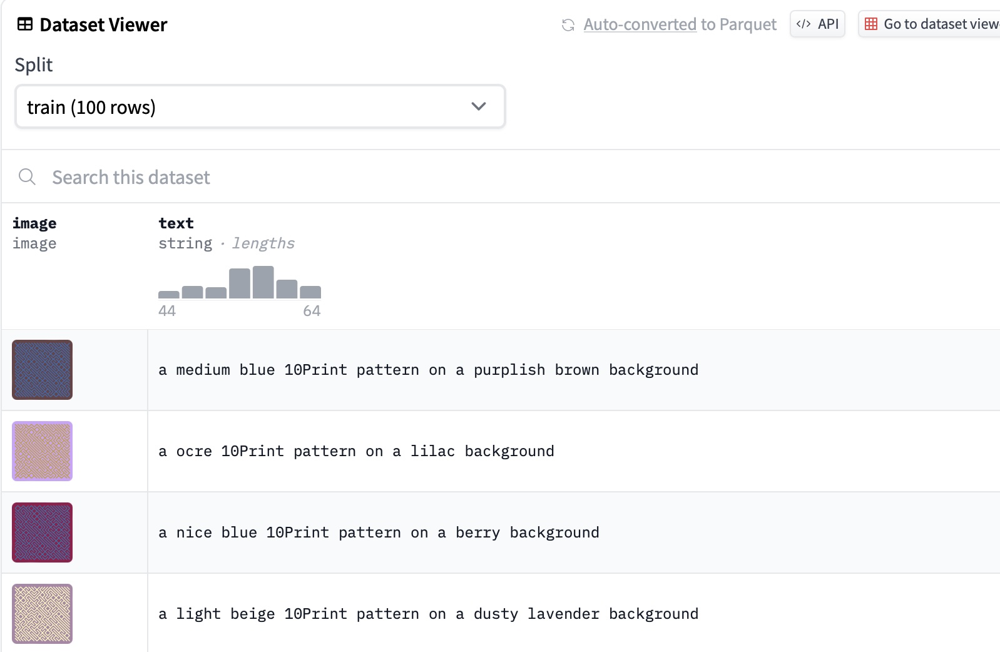

# Demo of how to push a dataset of 10Print images to the Hugging Face hub

This repo demos how how to create a dataset of labeled 10Print images and push them to the [Hugging Face hub](https://huggingface.co). You can find the dataset [here](https://huggingface.co/datasets/kfahn/10Print).

The 10Print algorithm is an easy way to make random-looking mazes. For each square in a grid, either an upward or downward slash is drawn based on some random probability. If you would like to learn more about the 10Print algorithm, I recommend that you watch Daniel Shiffman's [10Print Coding Challenge](https://thecodingtrain.com/challenges/76-10Print).

Note that you will need to create a free Huggin Face account and then go to settings and create a **WRITE** access token to push a dataset to the Hugging Face hub.

Once you have pushed the dataset to the hub, your dataset will be converted to Parquet format and a Dataset viewer will be created.

[Open Jupyter Notebook](10Print_labeled_image_dataset.ipynb)
